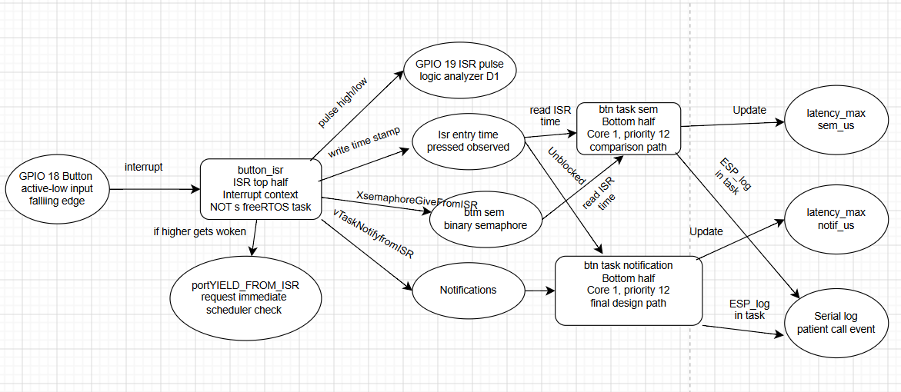
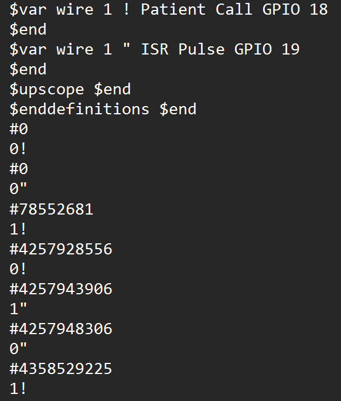
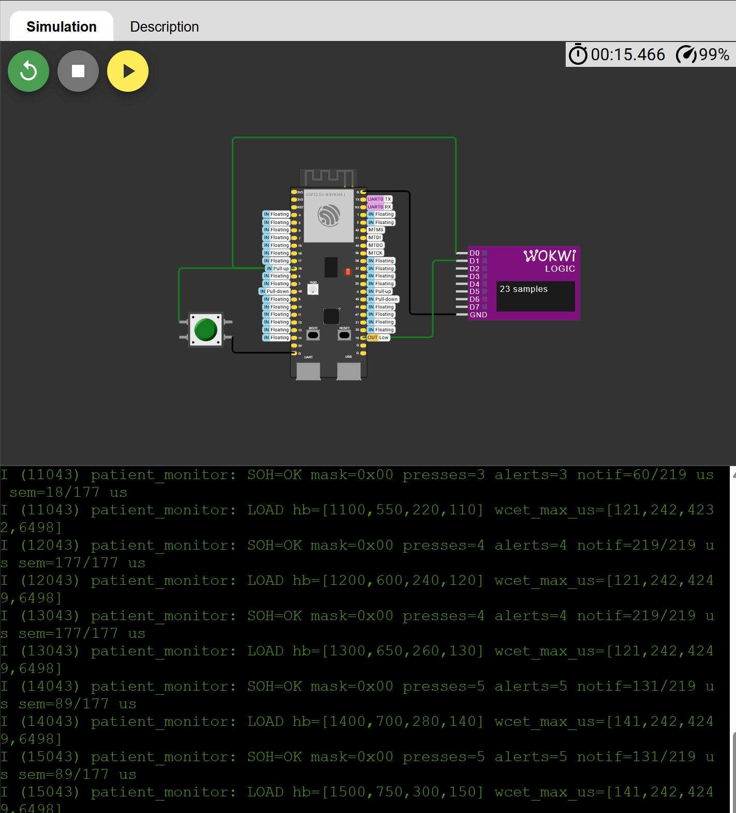

# Patient Vital Monitor — Real-Time Systems Final Capstone

An ESP32-S3 patient vital monitor that processes patient-call events through a bounded interrupt service routine and FreeRTOS bottom-half tasks while measuring latency and system health under periodic CPU load.

## Project Links

- Portfolio site: https://Sof-Arq.github.io/Capstone/
- Live Wokwi simulation: https://wokwi.com/projects/471019694429495297
- Demo video: Demo video: [Watch the Patient Vital Monitor demonstration](https://youtu.be/YSD9WOmxKe0)
- Main firmware: [docs/firmware/main.c](docs/firmware/main.c)
- Wokwi hardware configuration: [docs/firmware/diagram.json](docs/firmware/diagram.json)

## Project Overview

The Patient Vital Monitor demonstrates how a dual-core embedded real-time system can respond to a patient-call input while continuing to run periodic medical-monitoring tasks.

A pushbutton connected to GPIO 18 represents a patient requesting assistance. A falling edge activates a bounded interrupt service routine. The ISR records the event time, produces a timing pulse on GPIO 19, and signals two FreeRTOS bottom-half tasks.

The primary alert path uses a direct task notification. A binary semaphore path is retained to compare interrupt-to-task response latency.

The four periodic tasks from Application 2 provide a realistic processor load:

- ECG sampling
- Arrhythmia detection
- Alarm dispatch
- Patient logging

## Hardware and Software

- ESP32-S3 dual-core microcontroller
- ESP-IDF
- FreeRTOS
- Wokwi simulation
- Pushbutton on GPIO 18
- ISR timing pulse on GPIO 19
- Wokwi logic analyzer

## System Architecture



The system separates time-sensitive processing from observation and reporting.

### Core 1 — Real-Time Plane

Core 1 contains:

- GPIO 18 patient-call interrupt
- GPIO 19 ISR timing pulse
- Direct-notification patient-alert task
- Binary-semaphore comparison task
- ECG sampling task
- Arrhythmia detection task
- Alarm dispatch task
- Patient logging task

### Core 0 — Observability Plane

Core 0 contains:

- State-of-health reporting
- Periodic-task heartbeat monitoring
- Software-watchdog checks
- Interrupt-latency reporting
- WCET reporting
- Patient-call counter verification

This core separation prevents serial reporting and other observability work from directly blocking the real-time patient-alert path.

## Interrupt Design

The GPIO ISR is triggered by a falling edge on GPIO 18.

The ISR performs only bounded operations:

1. Applies the debounce guard.
2. Records the interrupt-entry timestamp.
3. Increments the detected patient-call counter.
4. Sets GPIO 19 high to mark ISR execution.
5. Gives the binary semaphore.
6. Sends the direct task notification.
7. Sets GPIO 19 low.
8. Requests a context switch when a higher-priority task is released.

Longer event processing is deferred to FreeRTOS bottom-half tasks.

## IPC Selection

### Direct Task Notification

The direct task notification is the selected patient-alert path because the original Application 3 experiment produced the lower maximum response latency in both tested operating modes.

Advantages for this design include:

- Direct ISR-to-task signaling
- Notification counts accumulate until consumed
- No separate queue or semaphore object is needed for the primary path
- Suitable for the one-producer, one-consumer patient-alert relationship

### Binary Semaphore

The binary semaphore is retained as a comparison path.

A binary semaphore can represent only an available or unavailable state. Multiple events may collapse if the semaphore is already available before the consumer takes it. For that reason, it is not used as the final patient-alert mechanism.

## Producer and Consumer Contracts

### GPIO ISR to Patient-Alert Task

- Producer: GPIO 18 falling-edge ISR
- Consumer: `patient_alert`
- IPC primitive: Direct task notification
- Consumer priority: 12
- Consumer core: Core 1
- Produced information: Event count and ISR timestamp
- Guard: 200 microsecond debounce interval
- Blocking behavior: ISR never blocks
- Overflow behavior: Notification counts accumulate until consumed

### GPIO ISR to Semaphore Comparison Task

- Producer: GPIO 18 falling-edge ISR
- Consumer: `sem_compare`
- IPC primitive: Binary semaphore
- Consumer priority: 12
- Consumer core: Core 1
- Purpose: Latency comparison only
- Limitation: Repeated events may collapse while the semaphore is already available

### Real-Time Plane to Observability Task

- Producers: ISR, bottom-half tasks, and periodic tasks
- Consumer: `soh_observer`
- Consumer priority: 3
- Consumer core: Core 0
- Reporting period: 1000 ms
- Data: Heartbeats, event counters, IPC latency, WCET maxima, and fault mask
- Failure response: Report `SOH=DEGRADED` with a nonzero fault mask

## Task Model and WCET Evidence

### Periodic Tasks

| Task | Medical Function | Core | Period | Deadline | Priority | Measured WCET | Utilization |
|---|---|---:|---:|---:|---:|---:|---:|
| Task A | ECG sampling | 1 | 10 ms | 10 ms | 15 | 141 µs | 0.01410 |
| Task B | Arrhythmia detection | 1 | 20 ms | 20 ms | 10 | 242 µs | 0.01210 |
| Task C | Alarm dispatch | 1 | 50 ms | 50 ms | 5 | 4249 µs | 0.08498 |
| Task D | Patient logging | 1 | 100 ms | 100 ms | 2 | 6498 µs | 0.06498 |

Task utilization is calculated using:

`U_i = C_i / T_i`

The total measured utilization is:

`U = 0.01410 + 0.01210 + 0.08498 + 0.06498`

`U = 0.17616 = 17.616%`

The Rate-Monotonic sufficient utilization bound for four periodic tasks is approximately:

`U_RM = 0.7568`

Because:

`0.17616 < 0.7568`

the measured periodic workload satisfies the sufficient Rate-Monotonic utilization test.

### Event-Driven Components

| Component | Type | Core | Priority or Context | Trigger | Purpose |
|---|---|---:|---|---|---|
| `button_isr` | ISR top half | 1 | Interrupt context | GPIO 18 falling edge | Records time, pulses GPIO 19, and signals bottom halves |
| `patient_alert` | Bottom-half task | 1 | Priority 12 | Direct task notification | Processes the primary patient-call event |
| `sem_compare` | Bottom-half task | 1 | Priority 12 | Binary semaphore | Provides IPC comparison evidence |
| `soh_observer` | Observability task | 0 | Priority 3 | Every 1000 ms | Reports system health, latency, heartbeats, and WCET |

## Interrupt and IPC Timing Results

### Original Application 3 Experiment

Each operating mode used 55 patient-call trials.

| Operating Mode | Trials | Notification Maximum | Semaphore Maximum | Faster Path |
|---|---:|---:|---:|---|
| Idle, `WITH_LOAD=0` | 55 | 30 µs | 2912 µs | Direct task notification |
| Loaded, `WITH_LOAD=1` | 55 | 2884 µs | 3254 µs | Direct task notification |

The loaded-to-idle factors were:

- Direct task notification: `2884 / 30 = 96.1×`
- Binary semaphore: `3254 / 2912 = 1.12×`

The direct task notification produced the lower maximum latency in both operating modes and was selected as the primary patient-alert path.

### Final Integrated Capstone Run

The final integrated system was tested with five patient-call events while the periodic workload and Core 0 observer were active.

| IPC Path | Last Measured Latency | Maximum Measured Latency | Processed Events |
|---|---:|---:|---:|
| Direct task notification | 131 µs | 219 µs | 5 |
| Binary semaphore | 89 µs | 177 µs | 5 |

The final run confirmed that all five detected patient-call events were processed while the periodic medical workload and state-of-health reporting remained active.

The final run was a functional validation with five events. It was not a repeat of the original controlled 55-trial experiment because the capstone added Core 0 observability and reorganized the logging behavior. The original experiment remains the main evidence used to select the direct task notification.

## Logic-Analyzer Evidence



The logic analyzer records:

- `Patient Call GPIO 18`
- `ISR Pulse GPIO 19`
- 1 ns timestamp resolution

Across five captured events, the measured delay between the GPIO 18 falling edge and the GPIO 19 pulse was approximately 15.2–15.4 µs.

The GPIO 19 ISR pulse width remained approximately 4.3–4.4 µs.

## Runtime Evidence



The final Serial Monitor output demonstrates:

- `SOH=OK`
- Fault mask `0x00`
- Five detected button presses
- Five processed patient alerts
- Notification and semaphore latency measurements
- Increasing task-heartbeat counters
- Maximum measured WCET values

## Hazard Analysis

| Hazard | Possible Effect | Detection | Mitigation |
|---|---|---|---|
| Patient-call event is detected but not processed | A patient request may not reach the alert task | Compare detected presses with processed alerts | Report a state-of-health fault and use notification counting |
| ISR performs excessive work | Increased blocking and interrupt latency | Measure GPIO 19 pulse width and response latency | Keep the ISR bounded and defer longer work |
| Serial reporting interferes with real-time processing | Increased alert latency or WCET | Monitor latency and WCET maxima | Run observability on Core 0 |
| Periodic monitoring task stalls | A medical-monitoring function stops updating | Heartbeat counter stops increasing | Report a software-watchdog fault |
| IPC response becomes excessive | Patient-call processing is delayed | Record last and maximum IPC latency | Use the lower-latency notification path |
| Button bounce creates repeated events | One press may be counted multiple times | Monitor timing between interrupts | Apply the 200 µs debounce guard |

## State of Health and Graceful Degradation

The Core 0 observer checks:

- Periodic-task heartbeats
- Detected patient-call count
- Processed alert count
- Notification and semaphore activity
- Maximum latency values
- Maximum WCET values

### Normal State

The normal output reports:

- `SOH=OK`
- Fault mask `0x00`
- Increasing heartbeat counters
- Matching patient-call and alert activity

### Degraded State

The system reports `SOH=DEGRADED` with a nonzero fault mask when:

- A periodic-task heartbeat stops advancing
- A patient-call event is detected without corresponding task activity
- A monitored event path stops responding

The essential ISR and patient-alert path remain on Core 1 while Core 0 reports the degraded condition. This makes the fault visible without adding diagnostic work to the ISR.

The prototype reports faults but does not automatically restart failed tasks or switch to redundant hardware.

## Engineering Decisions

### Why Core 1?

Core 1 contains the ISR, bottom-half tasks, and periodic medical workload so the time-sensitive path remains grouped on the real-time plane.

### Why Core 0?

Core 0 handles serial output and system-health monitoring. Reporting is slower and less time-sensitive than patient-call processing, so it is separated from the real-time plane.

### Why a Direct Task Notification?

The patient-call path has one ISR producer and one primary task consumer. The notification provides direct ISR-to-task signaling and preserves accumulated notification counts.

### Why Keep the Semaphore?

The semaphore provides a second IPC path for controlled comparison. It is not the final patient-alert mechanism.

### Why Use GPIO 19?

GPIO 19 produces a short pulse around ISR execution. This allows ISR timing to be observed externally without adding serial output inside the interrupt handler.

## Build and Run

### Run in Wokwi

1. Open the live Wokwi project:
   `https://wokwi.com/projects/471019694429495297`
2. Start the simulation.
3. Wait for the Serial Monitor to report `SOH=OK`.
4. Press the green patient-call button connected to GPIO 18.
5. Confirm that `presses` and `alerts` increase.
6. Confirm that notification and semaphore latency values update.
7. Confirm that periodic-task heartbeat counters continue increasing.
8. Stop the simulation to export the logic-analyzer VCD recording.

### Run from the Repository Files

The main project files are stored in:

- `firmware/main.c`
- `firmware/diagram.json`
- `firmware/ARQUIADEZ-FINAL-RTS26Summer.zip`

The ZIP contains the complete Wokwi project backup.

## Repository Structure

```text
Capstone/
├── docs/
│   ├── index.html
│   ├── architecture.png
│   └── assets/
│       ├── capstone-serial-soh.png
│       └── capstone-isr-logic-analyzer.png
├── firmware/
│   ├── main.c
│   ├── diagram.json
│   └── ARQUIADEZ-FINAL-RTS26Summer.zip
└── README.md
